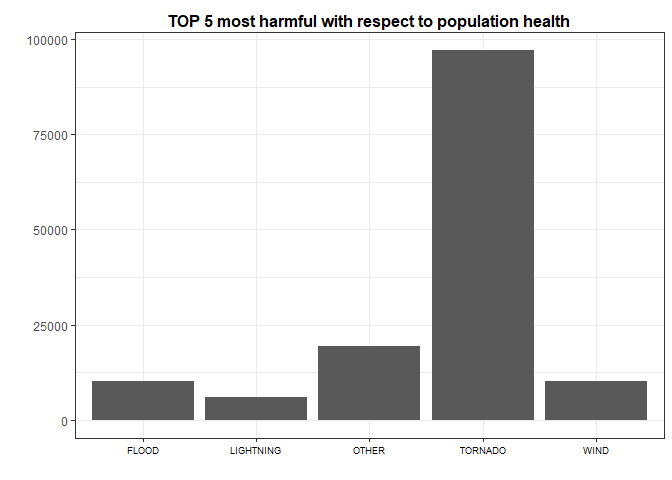
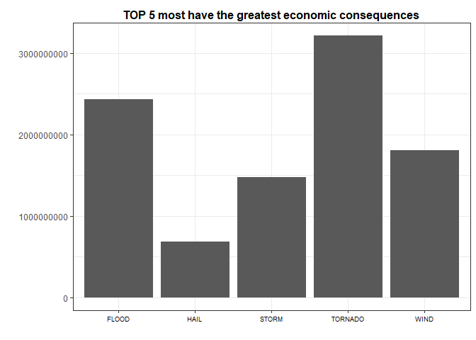

# Exploring the U.S. National Oceanic and Atmospheric Administration's (NOAA) storm database


```r
## LIBRARIES
library(stringr)
library(dplyr, warn.conflicts = FALSE)
library(ggplot2)
```

Generated Septiembre   7, 2017


# Synopsis

This project involves exploring the U.S. National Oceanic and Atmospheric Administration's (NOAA) storm database. This database tracks characteristics of major storms and weather events in the United States, including when and where they occur, as well as estimates of any fatalities, injuries, and property damage.

We want to answers two questions:  
1. Across the United States, which types of events (as indicated in the EVTYPE variable) are most
harmful with respect to population health?  
2. Across the United States, which types of events have the greatest economic consequences?  


# Data Processing

We are interested to study population health and economic consequences across the United States for all types of events:

**States**:  
- COUNTY: county numeric code  
- COUNTYNAME: county name   
- STATE: state code  

**Population health**:  
- FATALITIES: approx. number of deaths  
- INJURIES: approx. number of injuries

**Economic consequences**:  
- PROPDMG: approx. property damages  
- PROPDMGEXP: the units for property damage value  
- CROPDMG: approx. crop damages   
- CROPDMGEXP: the units for crop damage value  

**Events**:  
- EVTYPE: weather event (Tornados, Wind, Snow, etc..)  


## Pre-analysis

The fist step is load the data into R and do a preanalysis: 


```r
## UNZIP AND LOAD DATA
if(!file.exists("storm_data.csv"))
    unzip("storm_data.zip")
storm_data <- read.csv("storm_data.csv", sep=",", header=TRUE, stringsAsFactors = FALSE)


## NEW NUMBER OF TYPE OF EVENTS
length(sort(unique(storm_data$EVTYPE)))
```

```
## [1] 985
```

```r
head(sort(table(storm_data$EVTYPE), decreasing = TRUE))
```

```
## 
##              HAIL         TSTM WIND THUNDERSTORM WIND           TORNADO 
##            288661            219940             82563             60652 
##       FLASH FLOOD             FLOOD 
##             54277             25326
```

```r
## CLEAN ALL TYPE OF EVENTS' NAMES
# - All letters to uppercase
storm_data$EVTYPE <- toupper(storm_data$EVTYPE)
# - Refactory the name:
storm_data$EVTYPE <-  gsub("EROSIN", "EROSION",
                           gsub("TORNDAO", "TORNADO", 
                                gsub("AVALANCE", "AVALANCHE", 
                                     gsub("SUMMARY:", "SUMMARY", 
                                          gsub("SUMMARY OF", "SUMMARY", 
                                               gsub("LIGHTING", "LIGHTNING",
                                                    storm_data$EVTYPE)))))) 

storm_data$EVENT_ALIAS <- "OTHER"
storm_data$EVENT_ALIAS[grep("HAIL", storm_data$EVTYPE, ignore.case = TRUE)] <- "HAIL" 
storm_data$EVENT_ALIAS[grep("WIND", storm_data$EVTYPE, ignore.case = TRUE)] <- "WIND" 
storm_data$EVENT_ALIAS[grep("FLOOD", storm_data$EVTYPE, ignore.case = TRUE)] <- "FLOOD" 
storm_data$EVENT_ALIAS[grep("TORNADO", storm_data$EVTYPE, ignore.case = TRUE)] <- "TORNADO" 
storm_data$EVENT_ALIAS[grep("LIGHTNING", storm_data$EVTYPE, ignore.case = TRUE)] <- "LIGHTNING" 
storm_data$EVENT_ALIAS[grep("SNOW", storm_data$EVTYPE, ignore.case = TRUE)] <- "SNOW"  
storm_data$EVENT_ALIAS[grep("STORM", storm_data$EVTYPE, ignore.case = TRUE)] <- "STORM"  
storm_data$EVENT_ALIAS[grep("RAIN", storm_data$EVTYPE, ignore.case = TRUE)] <- "RAIN" 
storm_data$EVENT_ALIAS[grep("WINTER", storm_data$EVTYPE, ignore.case = TRUE)] <- "WINTER" 
storm_data$EVENT_ALIAS[grep("FIRE", storm_data$EVTYPE, ignore.case = TRUE)] <- "FIRE" 


## NEW NUMBER OF TYPE OF EVENTS
length(sort(unique(storm_data$EVENT_ALIAS)))
```

```
## [1] 11
```

```r
sort(table(storm_data$EVENT_ALIAS), decreasing = TRUE)
```

```
## 
##      HAIL      WIND     STORM     FLOOD   TORNADO     OTHER    WINTER 
##    289270    255356    113180     82690     60701     31615     19604 
##      SNOW LIGHTNING      RAIN      FIRE 
##     17636     15764     12241      4240
```


## Types of events most harmful with respect to population health
We need to aggreate the number of casualties by the event type.

```r
## FATALITIES/INJURIES BY EVENT TYPE 
storm_data_by_group <- group_by(storm_data, EVENT_ALIAS)
casualties <- summarize(storm_data_by_group,  
                        fatalities=sum(FATALITIES), 
                        injuries =sum(INJURIES),
                        total=sum(FATALITIES)+sum(INJURIES) 
) %>% arrange(desc(total))


## MOST HARMFULL
casualties[1,]
```

```
## # A tibble: 1 x 4
##   EVENT_ALIAS fatalities injuries total
##         <chr>      <dbl>    <dbl> <dbl>
## 1     TORNADO       5661    91407 97068
```


## Types of events have the greatest economic consequences
We need to look at the property damage and crop damage data reportings.   
- The property damage is represented with two fields: a number **PROPDMG** in dollars and the exponent **PROPDMGEXP**.  
- The crop damage is represented using two fields: **CROPDMG** in dollars and the exponent **CROPDMGEXP**.   

The first step in the analysis is to calculate the property and crop damage for each event.


```r
## EXPONENT EQUIVALENCE
sort(unique(storm_data$PROPDMGEXP))
```

```
##  [1] ""  "-" "?" "+" "0" "1" "2" "3" "4" "5" "6" "7" "8" "B" "h" "H" "K"
## [18] "m" "M"
```

```r
sort(unique(storm_data$CROPDMGEXP))
```

```
## [1] ""  "?" "0" "2" "B" "k" "K" "m" "M"
```

```r
exp_equivalence <- function(e){
    # K or k: thousand dollars (1000) (k)
    # M or m: million dollars (1000000) (m)
    # B or b: billion dollars (1000000000) (b)
    # the rest would be consider as dollars (d)
    if (e %in% c("h", "H"))
        return(2)
    else if (e %in% c("k", "K"))
        return(3)
    else if (e %in% c("m", "M"))
        return(6)
    else if (e %in% c("b", "B"))
        return(9)
    else if (!is.na(as.numeric(e))) 
        return(as.numeric(e))
    else if (e %in% c("", "-", "?", "+"))
        return(0)
    else {
        stop("Invalid exponent value.")
    }
}

## CALCULATE THE PROPERTY AND CROP DAMAGE
storm_data$PROPERTY <- storm_data$PROPDMG * (10 ^ exp_equivalence(storm_data$PROPDMGEXP))
storm_data$CROP <- storm_data$CROPDMG * (10 ^ exp_equivalence(storm_data$CROPDMGEXP))


## PROPERTY/CROP BY EVENT TYPE 
storm_data_by_group <- group_by(storm_data, EVENT_ALIAS)
damages <- summarize(storm_data_by_group,  
                     property=sum(PROPERTY), 
                     crop =sum(CROP),
                     total=sum(PROPERTY)+sum(CROP) 
) %>% arrange(desc(total))


## MOST HARMFULL
damages[1,]
```

```
## # A tibble: 1 x 4
##   EVENT_ALIAS   property     crop      total
##         <chr>      <dbl>    <dbl>      <dbl>
## 1     TORNADO 3215750010 100029.3 3215850039
```

# Results

After this analysis, we concluded that:

1- The **\textcolor{blue}{TORNADO}** is the event type that cause most number of deaths and injuries among all event types, with a total of 97068 (fatalities 5661 and injuries 91407) 


```r
## PLOT TOP 5 

ggplot(casualties[1:5,], aes(x=EVENT_ALIAS, y=total)) + geom_bar(stat="identity") +
    xlab("") + ylab("") +
    ggtitle("TOP 5 most harmful with respect to population health") +
    theme_bw() +
    theme(
        plot.title = element_text(size=12,lineheight=.7, face="bold", hjust = 0.5, vjust = -1.0, 
                                  color= "black"),
        axis.text.x = element_text(size=7, color= "black"),
        legend.position="none"
    )  
```

<!-- -->

2- The **\textcolor{blue}{TORNADO}** is the event type that have the greatest economic consequences among all event types, with a total of 3215850039.27 (property damages 3215750010 and crop damages 100029.27) 


```r
## PLOT TOP 5 

ggplot(damages[1:5,], aes(x=EVENT_ALIAS, y=total)) + geom_bar(stat="identity") +
    xlab("") + ylab("") +
    ggtitle("TOP 5 most have the greatest economic consequences") +
    theme_bw() +
    theme(
        plot.title = element_text(size=12,lineheight=.7, face="bold", hjust = 0.5, vjust = -1.0, 
                                  color= "black"),
        axis.text.x = element_text(size=7, color= "black"),
        legend.position="none"
    )  
```

<!-- -->
