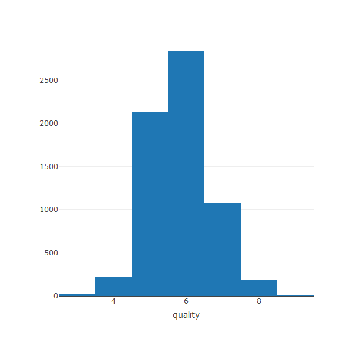

Project: Shiny Application and Reproducible Pitch
========================================================
author: Ailyn
date: 09/01/2018
autosize: true


About the Course Project
========================================================

1. Write a shiny application with associated supporting documentation. The documentation should be thought of as whatever a user will need to get started using your application.
2. Deploy the application on Rstudio's shiny server
3. Share the application link by pasting it into the provided text box
4. Share your server.R and ui.R code on github


How to use the application
========================================================

Using the data provide in "UCI Machine Learning Repository": http://archive.ics.uci.edu/ml/datasets/Wine+Quality, the goal of the project is to predict the quality of wine using some variables to predict with. 


The aplication is running on: https://ailynb.shinyapps.io/course9_project1/


ui.R and server.R Code: https://github.com/ailynb/datasciencecoursera/tree/master/Course%209/Project_1


Wine Quality Data Set 
========================================================



```
    alcohol            pH           density       volatile.acidity
 Min.   : 8.00   Min.   :2.720   Min.   :0.9871   Min.   :0.0800  
 1st Qu.: 9.50   1st Qu.:3.110   1st Qu.:0.9923   1st Qu.:0.2300  
 Median :10.30   Median :3.210   Median :0.9949   Median :0.2900  
 Mean   :10.49   Mean   :3.219   Mean   :0.9947   Mean   :0.3397  
 3rd Qu.:11.30   3rd Qu.:3.320   3rd Qu.:0.9970   3rd Qu.:0.4000  
 Max.   :14.90   Max.   :4.010   Max.   :1.0390   Max.   :1.5800  
    quality        color         taste     
 Min.   :3.000   red  :1599   bad   :2384  
 1st Qu.:5.000   white:4898   good  :1277  
 Median :6.000                normal:2836  
 Mean   :5.818                             
 3rd Qu.:6.000                             
 Max.   :9.000                             
```

Predit "quality" with Regression Tree
========================================================


```r
# - Create a series of testing/training partitions 
library(caret)
inTrain <- createDataPartition(wine$quality, p=0.7, list=FALSE)
training <- wine[inTrain,-7]
testing <- wine[-inTrain,]

# - Built a Model and Predict on the testing set
library(rpart) #recursive and partitioning trees
model <- rpart(quality ~. , data = training)
pred <- predict(model, newdata = testing)
MAE(testing$quality, pred)
```

```
[1] 0.6006746
```

